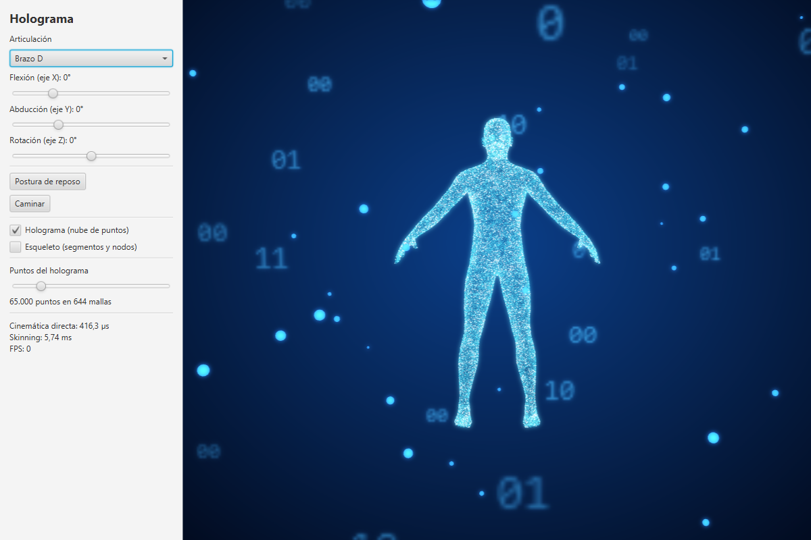
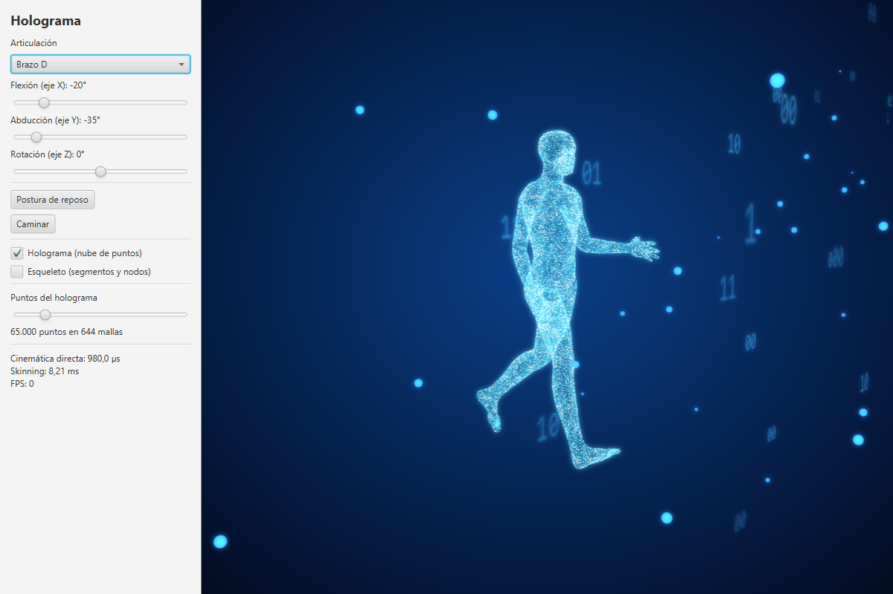
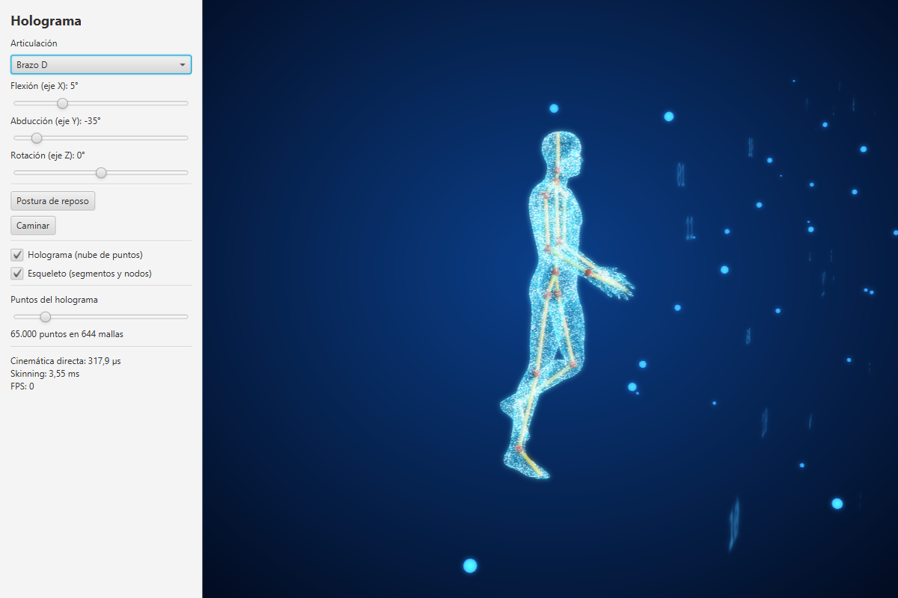
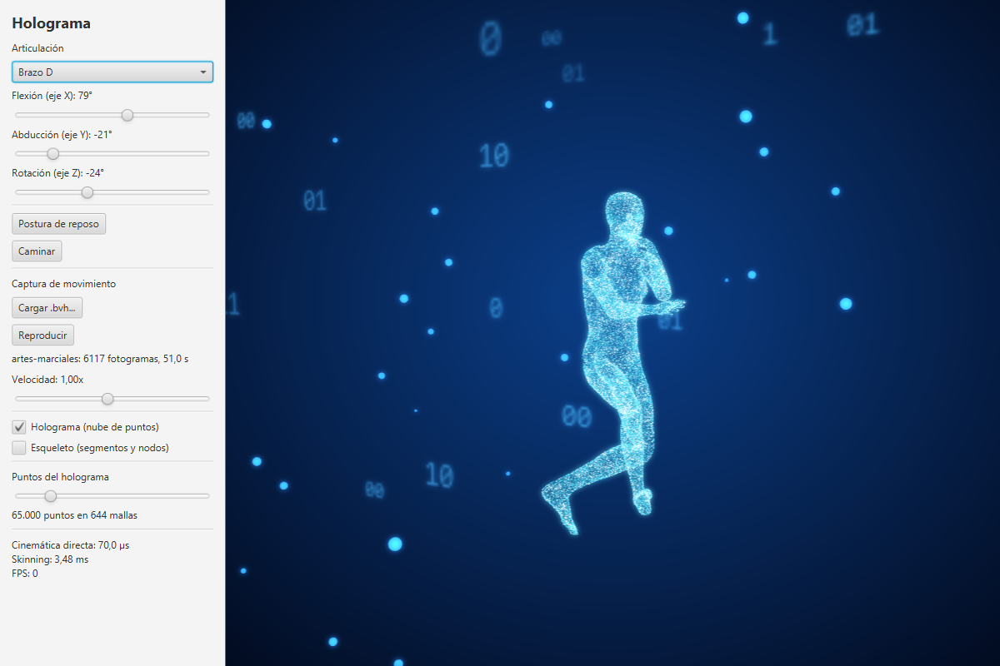
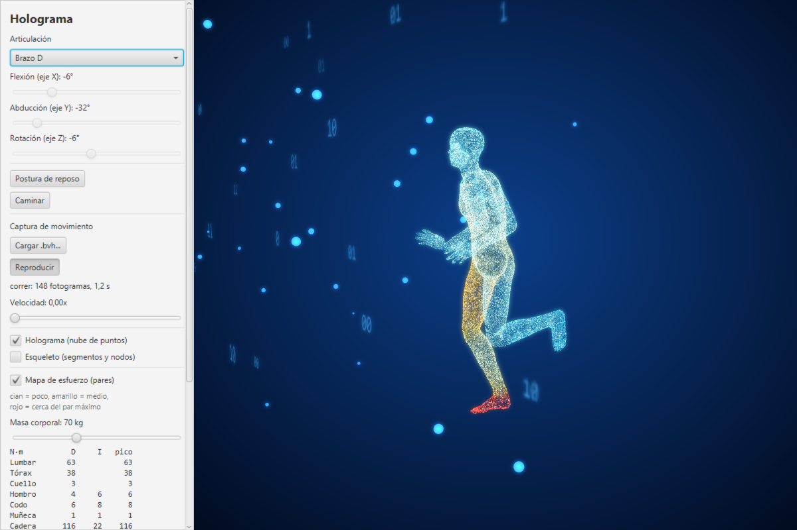
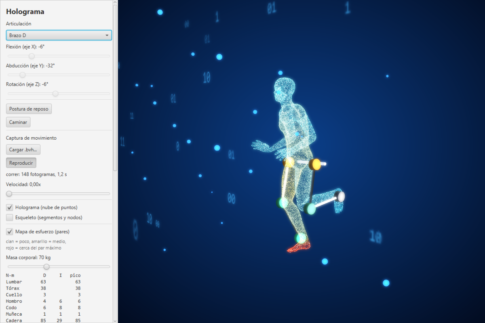
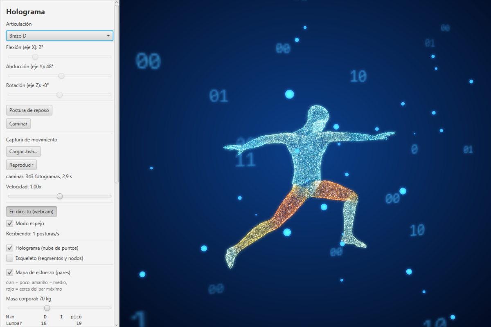

# Holograma

Etapa 3 de la ampliación del lab2 de ALED (Recursividad: cinemática directa de un exoesqueleto). Un cuerpo humano real, creado con MakeHuman, dibujado como un holograma de decenas de miles de puntos que se mueve con un esqueleto de 21 segmentos y la misma cinemática directa recursiva del lab2. El código está comentado a fondo para que sirva también como material de estudio.

| Caminando | Esqueleto dentro del holograma | Captura de movimiento real (.bvh) |
|---|---|---|
|  |  |  |

| Mapa de esfuerzo (corriendo) | Exoesqueleto virtual | En directo con MediaPipe |
|---|---|---|
|  |  |  |

## Las tres etapas

| Etapa | Repo | Qué es |
|---|---|---|
| 1 | [ALED-lab2](https://github.com/Ricardo4843/ALED-lab2) | La práctica: cinemática directa recursiva en 2D (15 segmentos, Swing) |
| 2 | [exoesqueleto](https://github.com/Ricardo4843/exoesqueleto) | El muñeco: la misma cinemática en 3D con matrices 4x4, cuerpo de 21 segmentos con armadura de tubos y benchmark recursivo vs iterativo |
| 3 | **holograma** (este) | El cuerpo real de MakeHuman como nube de puntos, con el esqueleto colocado automáticamente dentro |

## Cómo ejecutarlo

- **Eclipse:** File > Import > General > Existing Projects into Workspace, y seleccionar esta carpeta. Run sobre `holograma.gui.HologramApp`. JavaFX 23 ya viene incluido en `lib/`. Hace falta un JDK 21 o superior.
- **Terminal (PowerShell):** `.\run.ps1` compila y lanza el visor con `JAVA_HOME` o, si no está definido, con el JDK que trae Eclipse.

**En directo con la webcam** (hace falta Python 3.9-3.12): en otra terminal, `.\webcam\run.ps1`. La primera vez crea `webcam/.venv` e instala MediaPipe. Después, en el holograma, pulsar "En directo (webcam)". También vale un vídeo grabado con el móvil (`.\webcam\run.ps1 --video fondo.mp4 --loop`) o una foto (`--image foto.jpg`).

Controles:
- Arrastrar el ratón para girar la cámara y la rueda para el zoom.
- En el panel se elige una articulación y se mueve con los sliders.
- Botones para caminar y para volver a la postura de reposo.
- **Captura de movimiento:** "Reproducir" mueve el holograma con una grabación real de una persona (`.bvh`). Al arrancar se carga `animaciones/caminar.bvh`. Con "Cargar .bvh..." se elige otra (correr, saltar, bailar, artes marciales o cualquier `.bvh` descargado), y el slider cambia la velocidad (a 0 se queda en pausa).
- **En directo (webcam):** el holograma copia la postura que manda `webcam/pose_sender.py`. En modo espejo, tu derecha mueve su izquierda, como en un espejo. Funciona con el mapa de esfuerzo y con el exo.
- Se puede mostrar el holograma, el esqueleto o los dos.
- **Mapa de esfuerzo:** calcula el par de cada articulación (dinámica inversa) y colorea el holograma de cian a amarillo a rojo según lo cerca que esté de su par máximo. En el panel sale una tabla con los N·m de cada articulación (derecha, izquierda y el pico desde que se empezó), la fuerza del suelo y la fuerza residual. La masa corporal se cambia con un slider.
- **Exoesqueleto virtual:** motores en cadera, rodilla y/o tobillo que dan un porcentaje del par (con un par máximo y una masa por motor). Se dibujan por fuera de las piernas, en naranja cuando empujan y en verde cuando frenan. Su tabla da, por motor, el par y la potencia, los picos y las rpm, y debajo la masa del exo, la potencia media, la batería para 1 hora y cuánto par le quita a la persona.
- Hay un slider para el número de puntos (de 10.000 a 300.000).

## Cómo funciona

1. **El cuerpo.** Es un modelo exportado de [MakeHuman](http://www.makehumancommunity.org/) en `.obj`, que `ObjMesh` lee. MakeHuman deforma siempre la misma malla base de 13.380 vértices, así que sus pesos de skinning (`default_weights.mhw`, licencia CC0) valen para cualquier cuerpo exportado. Para leer ese fichero hay un lector de JSON escrito a mano por descenso recursivo (`JsonParser`).
2. **Las articulaciones.** No se colocan a mano. Alrededor de cada articulación hay un anillo de vértices que siguen a los dos huesos, y el centro de ese anillo es la articulación (`MakeHumanRig`). Con esas posiciones, `HumanSkeleton` calcula la longitud y la orientación de cada segmento. El esqueleto encaja en cualquier cuerpo que se exporte.
3. **Los puntos.** Se reparten al azar por la superficie, eligiendo cada triángulo con probabilidad proporcional a su área (suma acumulada + búsqueda binaria). Así la densidad es uniforme. Cada punto hereda los pesos de su triángulo mediante coordenadas baricéntricas (`PointCloud`).
4. **El movimiento.** La cinemática directa se calcula solo para los 21 segmentos, en microsegundos. Los puntos **no** son nodos del árbol: se mueven con *linear blend skinning*, `p = Σ wᵢ · Sᵢ · p₀` con `Sᵢ = Frame_actual · Frame_reposo⁻¹`.
5. **El aspecto.** Los puntos son tetraedros diminutos con material autoiluminado. El resplandor es el efecto `Bloom` de JavaFX, aplicado a la vista 3D.

6. **La captura de movimiento.** Un `.bvh` trae el esqueleto de la persona grabada (un árbol, leído con otro parser por descenso recursivo, `BvhMotion`) y los giros de cada articulación en cada fotograma. Su esqueleto no es el nuestro: tiene otros huesos, otras proporciones, otros ejes y otra postura de reposo (en "T" en vez de en "A"), así que no se pueden copiar los ángulos. `Retargeter` copia **direcciones**:
   - Cinemática directa del `.bvh` para saber dónde está cada articulación suya.
   - Para cada segmento nuestro, la orientación que debería tener en el mundo: el eje Z va de una articulación a otra (muslo = de `RightUpLeg` a `RightLeg`). El giro sobre su propio eje sale del plano de la rodilla o el codo, que son bisagras, y si no, de cuánto ha girado esa articulación del `.bvh` desde el primer fotograma.
   - Recorriendo el árbol desde la pelvis (recursivo), se pasa a ángulos locales, `local = (padre · base)⁻¹ · deseada`, y se descompone en ángulos de Euler (`Matrix4.eulerXYZ`). Los límites articulares recortan lo imposible, y cada hijo se calcula con la orientación real del padre, ya recortada, para que los errores no se acumulen.
   - Los nombres de las articulaciones se reconocen en los formatos más comunes (CMU, Mixamo, Bandai Namco...), y los ejes del fichero (Y o Z arriba) se deducen solos. El retargeting tarda unos 20 µs por fotograma.

7. **Los pares articulares (dinámica inversa).** `InverseDynamics` hace Newton-Euler recursivo. Cada segmento tiene masa, centro de masas e inercia (tablas de de Leva, 1996, escaladas a la masa corporal), y necesita una fuerza `m·a` y un momento `I·α + ω×(I·ω)` para moverse como se mueve. Recorriendo el árbol **de las hojas a la raíz** (postorden, al revés que la cinemática directa), en cada articulación se despeja lo que tiene que hacer el padre, sabiendo ya lo que hacen los hijos:
   - Las velocidades y aceleraciones salen por diferencias finitas, con la postura 0,08 s antes y después. Un paso más corto amplifica el ruido de la captura (al caminar salían fuerzas de 4 veces el peso), y 0,08 s hace de filtro de unos 6 Hz, como en los laboratorios de biomecánica.
   - Como no hay plataformas de fuerza, la fuerza del suelo se estima: es la que necesita el cuerpo entero (`Σ m·(a − g)`), aplicada en el centro de presión que equilibra el momento total. Ese punto se limita al polígono de apoyo de los pies (envolvente convexa por cadena monótona), y si con dos pies se reparte con la regla de la palanca. Lo que no cuadra queda como **fuerza residual** en la pelvis.
   - Para la física se usa la trayectoria real de la cadera, no la de "cinta de correr" del dibujo: sin los frenazos y acelerones de cada paso, la cadera salía con pares 2 veces mayores.
   - Resultado con `caminar.bvh` y 70 kg: tobillo ~115 N·m, rodilla ~90 y cadera ~130 de pico, y una fuerza del suelo de 1,3 veces el peso. Al correr, tobillo ~230 y 2,2 veces el peso. Son del orden de los valores publicados, pero orientativos: masas de una persona media, sin músculos (es el par neto) y con un par máximo por articulación aproximado.

8. **El exoesqueleto virtual.** `Exoskeleton` es un controlador de **asistencia proporcional**: cada motor da `asistencia × par necesario` en flexión/extensión, recortado a su par máximo, y la persona hace el resto. `InverseDynamics` no sabe nada de motores: pregunta a través de la interfaz `Assistance`. El exo además **pesa**: motores y barras se suman como masas a los segmentos, así que la dinámica los tiene en cuenta. Con `caminar.bvh`, 70 kg y motores de 1,5 kg en cadera y rodilla (7,6 kg en total):
   - Con los motores apagados, el exo solo pesa y sube el pico de la cadera de 129 a 145 N·m.
   - Al 50% de asistencia le quita a la persona un 23% del par de cadera y rodilla, con unos 42 W mecánicos de media.
   - La rodilla, al caminar, casi solo **frena** (42 J frenando frente a 12 J empujando): funciona como un amortiguador, y un motor con regeneración podría recargar la batería.
   - Un motor en el tobillo ayuda al tobillo, pero sus 1,5 kg cuelgan lejos de la cadera y su pico vuelve a subir. Por eso los exos de verdad ponen los motores arriba y bajan la fuerza con cables.

9. **En directo con la webcam.** Son dos programas que se hablan por la red local:
   - `webcam/pose_sender.py` (Python): OpenCV lee la cámara (o un vídeo), MediaPipe Pose Landmarker (una red neuronal) encuentra 33 puntos del cuerpo en 3D, en metros, y los manda en JSON por **UDP** a `127.0.0.1:5005`. Se usa UDP y no TCP porque en vídeo en directo, si se pierde una postura, da igual: llega otra en 1/30 s.
   - `LiveReceiver` (Java) escucha en un **hilo aparte**, porque `receive()` se queda bloqueado esperando y congelaría la ventana. Lee el JSON con el mismo `JsonParser` de los pesos de MakeHuman y deja la última postura en una `AtomicReference`, que es la forma segura de pasar un objeto de un hilo a otro.
   - `LiveRetargeter` hace lo mismo que `Retargeter` (copiar direcciones y recorrer el árbol desde la pelvis), pero solo con posiciones: MediaPipe no da giros, así que lo que no se puede deducir (como la pronación del antebrazo) se queda neutro. Tiene un filtro exponencial contra el temblor (`s·anterior + (1−s)·nuevo`), y si no se ven las piernas (sentado delante del ordenador) se quedan en reposo. El suelo se pone en cada fotograma haciendo que el pie más bajo lo toque.
   - Para la dinámica en directo no se conoce el futuro: se guarda una **cola** con las posturas del último segundo y se calcula para la de hace 0,08 s, con la anterior y la última.
   - Con una sola cámara, la profundidad tiene errores de varios centímetros, así que en directo un pie cuenta como apoyado hasta a 10 cm del suelo (3 cm con las animaciones).

### Rendimiento: de 5 a 60 FPS

La primera versión recalculaba en Java cada punto en cada fotograma. Calcularlos costaba unos 4 ms, pero JavaFX tarda mucho en reprocesar una malla que cambia, y con 65.000 puntos iba a **5 FPS**.

La solución sale de la propia fórmula. Con dos huesos, `w·Sa·p + (1−w)·Sb·p = (w·Sa + (1−w)·Sb)·p`: la media ponderada de dos matrices es otra matriz. Por eso los puntos se agrupan por pareja de huesos y por peso (redondeado a 1/16). Cada grupo es una malla quieta con una única transformación, que aplica la tarjeta gráfica. En cada fotograma solo se calculan unas 650 matrices.

Resultado medido caminando (`--fpstest=8`):

| Puntos | FPS antes | FPS ahora |
|---|---|---|
| 65.000 | 5 | ~59 |
| 162.500 | 2 | ~59 |
| 325.000 | – | ~42 |

## Estructura

- `src/holograma/kinematics/`: `Matrix4`, `Vec3`, `Segment`, `Node3D`, `ForwardKinematics3D` (recursiva + iterativa), `HumanSkeleton` (esqueleto construido a partir de las articulaciones)
- `src/holograma/dynamics/`: `InverseDynamics` (pares articulares por Newton-Euler recursivo, fuerza del suelo y polígono de apoyo), `Exoskeleton` (controlador, masas y estadísticas de los motores)
- `src/holograma/mocap/`: `BvhMotion` (lector de `.bvh` y su cinemática directa), `Retargeter` (pasa el movimiento del esqueleto del `.bvh` al nuestro), `LiveReceiver` y `LiveRetargeter` (en directo desde MediaPipe)
- `webcam/`: `pose_sender.py` (MediaPipe → UDP), `run.ps1` (crea el entorno y lo lanza) y `requirements.txt`
- `src/holograma/body/`: `ObjMesh` (lector de .obj), `JsonParser` (JSON por descenso recursivo), `MakeHumanRig` (pesos y articulaciones), `PointCloud` (holograma)
- `src/holograma/gui/HologramApp.java`: visor JavaFX (y `ExoView`, el dibujo del exo). Tiene también un modo captura (`--snapshot=f.png [--walk=s] [--yaw=grados] [--show=cloud,skeleton] [--points=n] [--bvh=f.bvh --bvhtime=s] [--effort=1] [--exo=1 [--ankle=1]] [--live=1]`) y una prueba de rendimiento (`--fpstest=segundos [--nowalk=1] [--bvh=f.bvh]`).
- `modelo/`: el cuerpo exportado de MakeHuman (`cuerpo.obj`) y los pesos de la malla base (`default_weights.mhw`, CC0, de MakeHuman 1.3.0)
- `animaciones/`: capturas de movimiento de la base de datos de CMU (caminar, correr, saltar, bailar, artes marciales)
- `lib/`: JavaFX 23.0.2 (jars para Windows de Maven Central)

Para usar otro cuerpo: en MakeHuman, exportar como Wavefront obj en centímetros, sin ropa ni pelo, y guardarlo como `modelo/cuerpo.obj`.

## Ideas para seguir

- Cinemática inversa: dar la posición de la mano o del pie y calcular los ángulos (CCD o jacobiano).
- Controladores de exo más realistas: por fases de la marcha, o con el par limitado por la curva par-velocidad de un motor real.
- Dinámica con músculos (no solo el par neto) o simulación directa: eso ya no es para JavaFX. Habría que pasar a OpenSim (tiene API Java) o a MuJoCo (Python).

Para más animaciones: la [base de datos de CMU](http://mocap.cs.cmu.edu/) tiene más de 2.500 en `.bvh` (conversión de cgspeed; hay copias en GitHub, por ejemplo [una-dinosauria/cmu-mocap](https://github.com/una-dinosauria/cmu-mocap)), y también funcionan las de Mixamo y las del dataset de Bandai Namco.

Créditos: modelo y pesos generados con MakeHuman (makehumancommunity.org). Los modelos exportados y `default_weights.mhw` tienen licencia CC0. Las animaciones de `animaciones/` son de la CMU Graphics Lab Motion Capture Database (mocap.cs.cmu.edu), creada con la financiación de la NSF EIA-0196217, en la conversión a BVH de cgspeed (sujetos 02_01, 09_01, 49_02, 05_01 y 135_01).
